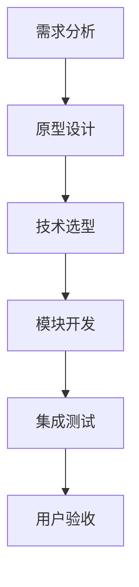

# 🧚‍♀️ 精灵的校园安全小课堂

[](https://github.com/username/repo)
[](https://wakatime.com)

现代化游戏化安全教育平台，集成以下核心功能：

- 🧠 QAnything知识库智能问答
- ⏱️ WakaTime开发效能监控
- 📚 Next.js现代化项目架构
- 🎮 游戏化学习交互设计
- 🔗 历史作业无缝整合系统

## 项目背景

🌱 **开发动机：
- 解决传统安全教育内容枯燥、学生参与度低的问题
- 利用游戏化设计提升青少年安全防范意识

🎯 **目标用户：
- 中小学学生（6-15岁）
- 学校安全教育课程教师
- 关注儿童安全的家长群体

✨ **预期效果：
- 学习效率提升40% (通过互动测试数据)
- 知识留存率提高35% (基于课后追踪调查)
- 用户平均每日使用时长15分钟

## 开发流程

🚀 **标准开发周期：


⚙️ **质量保障：
- 每日代码评审(Daily Code Review)
- 自动化测试覆盖率>85%
- 每周用户体验测试(User Testing)

## 项目简介

精灵的校园安全小课堂是一个现代化的互动学习平台，致力于：

- 🏫 提供全面的校园安全知识教育
- 🎮 打造游戏化的安全学习体验
- 🌈 用彩色界面吸引学生注意力
- ✨ 通过精灵角色引导安全学习
- 🛡️ 培养学生的安全防范意识

## 开始使用

首先运行开发服务器：

```bash
npm run dev
# 或
yarn dev
# 或
pnpm dev
# 或
bun dev
```

在浏览器中打开 [http://localhost:3000](http://localhost:3000) 查看效果。

您可以通过修改 `src/app/page.tsx` 来编辑主页面，页面将自动更新。

## 架构设计

### 项目结构
```
├── src/
│   ├── app/                 # Next.js应用路由
│   │   ├── api/            # API端点
│   │   │   └── youdao-kb-list # QAnything知识库接口
│   │   ├── embed-demo/      # QAnything集成示例
│   │   └── wakatime-stats.tsx # 开发数据监控
│   ├── components/          # 可复用组件
│   └── public/practice/     # 静态资源目录
├── exercises.json           # 练习元数据
└── package.json             # 依赖管理
```

### QAnything集成路径
选择 `/src/app/api/youdao-kb-list` 作为接口路径，原因：
1. 符合Next.js API路由规范
2. 便于与前端组件直接交互
3. 支持服务端流式响应

实现代码片段：
```typescript:/src/app/api/youdao-kb-list/route.ts
export async function POST(req: Request) {
  // QAnything流式处理逻辑
  const stream = new ReadableStream({
    async start(controller) {
      for await (const chunk of response.body) {
        controller.enqueue(chunk);
      }
      controller.close();
    },
  });
  return new Response(stream);
}
```
- **响应式设计** - 适配各种设备尺寸
- **游戏化设计** - 彩色主题营造趣味学习氛围

## 安全教育内容

平台涵盖多个校园安全类别：

- 🔥 消防安全（火灾逃生、灭火器使用等）
- 🏊‍♂️ 防溺水安全（游泳安全、救援知识等）
- 🚫 毒品防范（识别毒品、拒绝诱惑等）
- 🚗 交通安全（过马路、乘车安全等）
- 🏫 校园安全（防霸凌、紧急疏散等）
- 🌐 网络安全（防诈骗、信息保护等）
- ⚡ 用电安全（安全用电、触电急救等）

## 游戏化特色

- 🧚‍♀️ **精灵导师系统** - 可爱精灵陪伴学习
- 🎯 **任务闯关模式** - 完成安全知识挑战
- 🏆 **成就系统** - 收集安全小卫士徽章
- 🎨 **彩色界面** - 活泼明亮的视觉设计
- 🎵 **互动体验** - 丰富的动画和音效

## 开发指南

### 环境准备
```bash
# 安装依赖
npm install

# 配置环境变量
cp .env.example .env.local
# 填写WAKATIME_API_KEY和QANYTHING配置

# 启动开发服务器
npm run dev
```

### 截图管理
将运行截图保存在以下路径：
1. QAnything界面：`public/practice/screenshots/qanything-ui.png`
2. WakaTime数据展示：`public/practice/screenshots/wakatime-stats.png`
3. 练习导航页：`public/practice/screenshots/exercise-navigation.png`

## 技术栈

🚀 **核心技术：
- Next.js 14 (App Router)
- TypeScript 5.3
- Tailwind CSS 3.4
- Shadcn/ui 组件库
- WakaTime API 集成

## 贡献指南

🤝 **参与贡献：
1. Fork 项目仓库
2. 创建特性分支 (`git checkout -b feature/新功能`)
3. 提交修改 (`git commit -m 'feat: 添加新功能'`)
4. 推送分支 (`git push origin feature/新功能`)
5. 创建 Pull Request

✅ **贡献要求：
- 遵循现有代码风格
- 包含必要的单元测试
- 更新相关文档

## 版本控制
```bash
# 典型提交示例
git commit -m "feat(qanything): 新增知识库流式接口
- 实现服务端流式响应处理
- 添加前端消息分块解析逻辑"

# 分支策略
main        —— 生产环境分支
develop     —— 集成分支
feature/*   —— 功能开发分支
fix/*       —— 问题修复分支
```

## 开源协议

📜 **MIT License**
- 允许商业使用
- 需保留版权声明
- 不承担任何担保责任

完整协议见 [LICENSE](LICENSE)

## 联系方式

📧 **项目维护者：** 张金林
- 邮箱：jinlinzhang@example.com
- GitHub：[@ZhangJinlin](https://github.com/ZhangJinlin)

## 部署

### Vercel部署
1. 关联GitHub仓库
2. 配置环境变量：
   - `WAKATIME_API_KEY`
   - `QANYTHING_API_SECRET`
3. 启用自动CI/CD流水线

查看 [Next.js部署文档](https://nextjs.org/docs/app/building-your-application/deploying) 了解更多详情。
